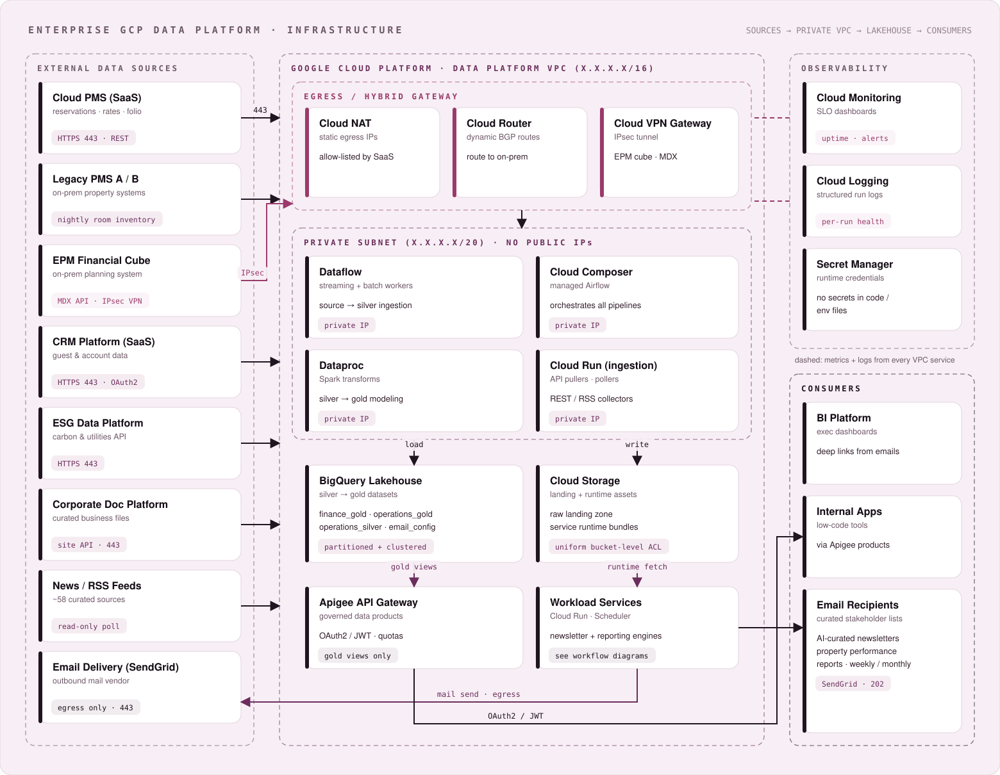
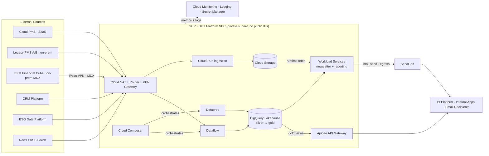
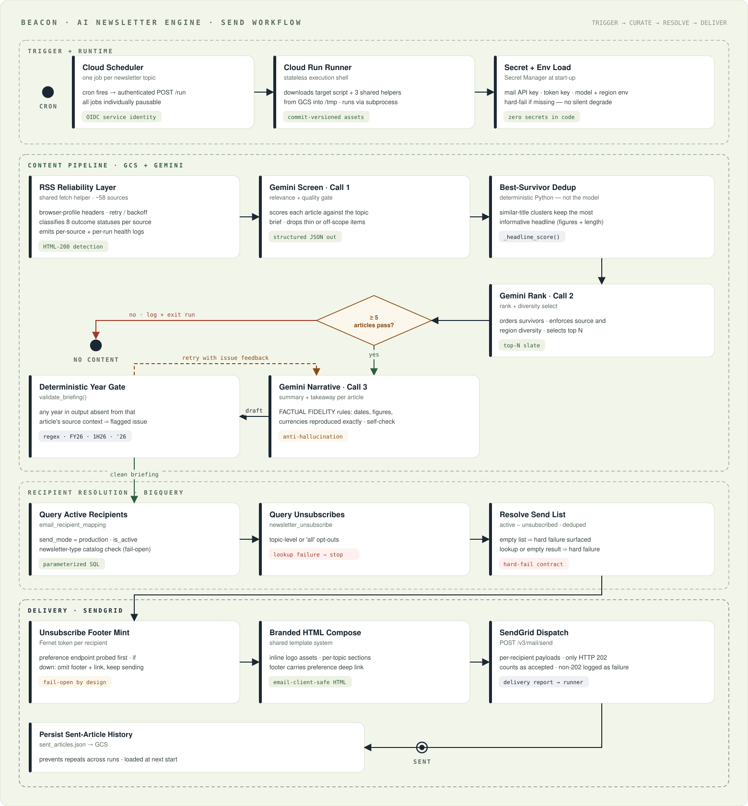
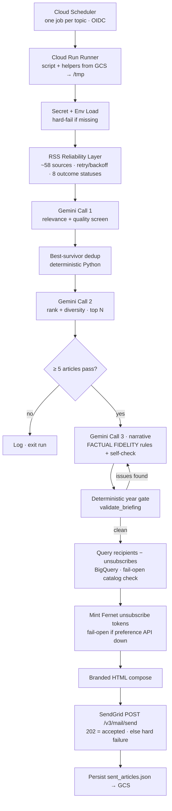
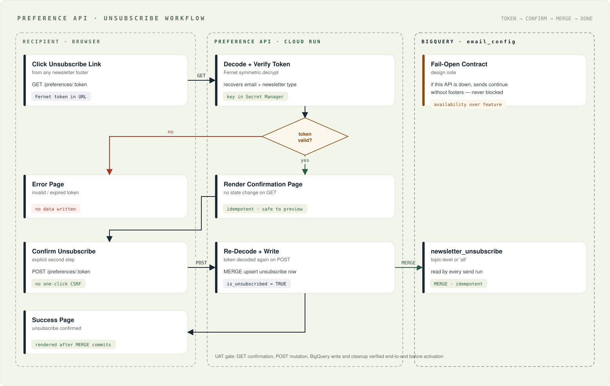
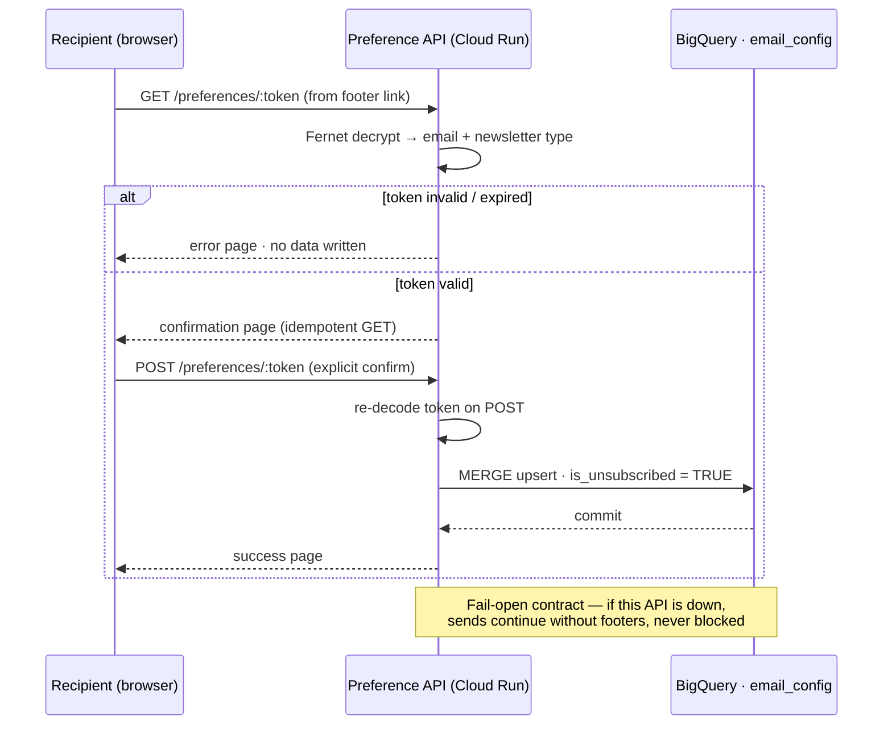
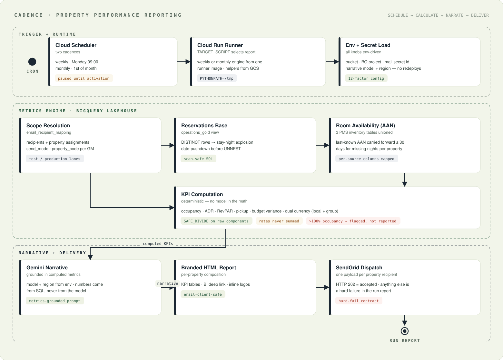

# Enterprise GCP Data & Intelligence Platform — Architectural Blueprint

[](#)
[](#)
[](#)
[](#)
[](#)
[](#)

---

## Executive Summary

A production data platform on Google Cloud for a multinational hospitality group, spanning a private-VPC lakehouse (Dataflow → BigQuery silver/gold) and two serverless intelligence products built on top of it:

- **Beacon — an AI newsletter engine.** Seven topic-focused executive newsletters, each fully unattended: ~58 curated RSS sources fetched through a hardened reliability layer, a three-stage Gemini curation pipeline (relevance screen → rank/diversity select → grounded narrative), and SendGrid delivery to a BigQuery-managed recipient base with self-service unsubscribe.
- **Cadence — property performance reporting.** Weekly and monthly KPI emails (occupancy, ADR, RevPAR, pickup, budget variance) computed deterministically in BigQuery across multi-PMS source data, narrated by Gemini strictly from the computed numbers, delivered per property.

Measured platform outcomes:

- **Analyst curation time per newsletter issue → zero.** Seven weekly editorial products run with no human in the loop; humans set topic scope and source lists only.
- **A three-layer anti-hallucination stack** (prompt fidelity contract, in-prompt self-check, deterministic year-gate validator) that caught and now structurally prevents a real class of LLM date-mutation errors — verified by an 8-case functional gate test.
- **~180-stakeholder certified recipient base** managed as data (BigQuery MERGE operations, catalog-driven newsletter types) — adding a newsletter topic requires **zero code changes**.
- **Nine services migrated sandbox → UAT → production** with a runbook discipline of paused-by-default schedulers, send-disabled dry runs, single-operator test lanes, and hash-verified file uploads.

---

## Data Security & Scope Disclaimer

> **Architectural Blueprint Notice:** This repository serves strictly as a sanitized, open-source structural blueprint demonstrating [system design, data architecture, and workflow automation]. All proprietary enterprise API integrations, sensitive webhooks, internal routing logic, and production access tokens have been completely omitted or mocked for security and compliance.

All project IDs, bucket names, dataset/table names, service identities, endpoints, property codes, and recipients in this repository are placeholders or fictional examples. Product-area names are neutral stand-ins for internal codenames.

---

## Visual Architecture

### Platform Infrastructure — Private VPC, Hybrid Connectivity, Lakehouse



<details>
<summary><strong>Diagram-as-code source (Mermaid)</strong></summary>



</details>

### Beacon — AI Newsletter Engine, End-to-End Send Workflow



<details>
<summary><strong>Diagram-as-code source (Mermaid)</strong></summary>



</details>

### Preference API — Self-Service Unsubscribe



<details>
<summary><strong>Diagram-as-code source (Mermaid)</strong></summary>



</details>

### Cadence — Property Performance Reporting



<details>
<summary><strong>Diagram-as-code source (Mermaid)</strong></summary>

```mermaid
flowchart TB
    SCHED[Cloud Scheduler<br/>weekly Mon 09:00 · monthly 1st] --> RUNNER[Cloud Run Runner<br/>TARGET_SCRIPT = weekly | monthly]
    RUNNER --> ENV[Env + secret load<br/>bucket · BQ project · mail secret · model]
    ENV --> SCOPE[Scope resolution<br/>recipients + property assignments]
    SCOPE --> RES[Reservations base<br/>DISTINCT → stay-night explosion<br/>date-pushdown before UNNEST]
    RES --> AAN[Availability AAN<br/>3 PMS inventory tables unioned<br/>≤ 30-day carry-forward]
    AAN --> KPI[KPI computation — deterministic<br/>occupancy · ADR · RevPAR · pickup · variance<br/>SAFE_DIVIDE · rates never summed]
    KPI --> NARR[Gemini narrative<br/>numbers from SQL, never the model]
    NARR --> HTML[Branded HTML report<br/>KPI tables · BI deep link]
    HTML --> SGD[SendGrid · one payload per property recipient<br/>202 = accepted · else hard failure]
```

</details>

---

## Technology Stack

| Layer | Technology | Why it earns its place |
|---|---|---|
| Compute | **Cloud Run** | Nine independent stateless services scale to zero between runs — the whole delivery estate costs nothing while idle. |
| Scheduling | **Cloud Scheduler** | One pausable cron job per product gives operators a per-topic kill switch with no code involved. |
| Warehouse | **BigQuery** | One engine serves both the lakehouse (silver/gold modeling) and the operational config tables, so recipient logic is just SQL. |
| Ingestion | **Dataflow / Dataproc / Composer** | Managed streaming, Spark transforms, and Airflow orchestration inside a no-public-IP private subnet. |
| Object storage | **Cloud Storage** | Runtime scripts and helpers are commit-versioned bucket artifacts — services fetch exactly what was reviewed, no image rebuilds. |
| LLM | **Gemini (Vertex AI)** | Three-call curation pattern with structured JSON outputs; model and region are env-driven so upgrades need no redeploy. |
| Delivery | **SendGrid** | The only egress-mail dependency; HTTP 202 is the sole success signal, and everything else is a surfaced failure. |
| Secrets | **Secret Manager** | Zero credentials in code, env files, or bucket assets; services load secrets at start-up and hard-fail if missing. |
| Tokens | **Fernet (symmetric)** | Unsubscribe links are self-contained encrypted tokens — no lookup tables, no PII in URLs. |
| Hybrid | **Cloud VPN + NAT + Apigee** | IPsec MDX access to the on-prem EPM cube, static egress IPs for SaaS allow-lists, and governed gold-view products for consumers. |

---

## Engineering Highlights

### The fail-open / hard-fail contract

Every failure mode is deliberately classified. **Fail-open (log, degrade, continue):** unsubscribe filtering, preference-link generation, footer injection, newsletter-type catalog checks — a preference-service outage must never block operational sends. **Hard-fail (run reports failure):** recipient lookup, zero/partial delivery, non-202 delivery responses, sent-history load/save, required property skips, stale finance data, missing helpers, child-process errors. The runner returns a structured per-run delivery report either way.

### The anti-hallucination stack

A production incident — the model silently rewriting "first half of 2026" as "2024" — produced a three-layer defense:

1. **Prompt fidelity contract:** dates, years, quarters, currencies, and figures must be reproduced exactly as they appear in source context; absent data is omitted, never inferred.
2. **In-prompt self-check:** the model re-reads each summary against its source before emitting.
3. **Deterministic year gate:** a regex validator extracts every year form (`2026`, `FY26`, `1H26`, `'26`) from generated text and flags any year absent from that article's source — flagged issues feed the retry loop as structured feedback.

The deterministic layer is the backstop: it requires no model cooperation and was verified with an 8-case functional test including the exact incident scenario.

### Metrics that refuse to lie

KPI math is deterministic SQL, never the model. Rates (ADR, RevPAR, occupancy) are computed with `SAFE_DIVIDE` on raw components and are never summed across grains. Availability uses a documented ≤ 30-day carry-forward across three PMS inventory sources. And an impossible result (occupancy > 100%) is **presented as a flagged data-quality finding with raw components — not as an answer.**

### Config as data

Newsletter types live in a BigQuery catalog table, not in code. Registering a new topic is one guarded `MERGE` (with a naming `ASSERT`) — no deploy, no code review, no service restart.

---

## Repository Map

```
docs/                          Architecture deep-dive · migration playbook
docs/assets/                   Hand-built SVG diagrams (render natively on GitHub)
services/newsletter_engine/    Topic-newsletter template + RSS reliability layer (illustrative)
services/reporting/            Deterministic KPI engine skeleton
services/preference_api/       Fernet-token unsubscribe API skeleton
services/runner/               Cloud Run runner shell (GCS-fetch + subprocess pattern)
services/shared/               BigQuery recipient resolution (fail-open catalog check)
sql/tables/                    Recipient / unsubscribe / catalog DDL (runnable shapes)
sql/operations/                Guarded MERGE templates for day-2 operations
sql/seeds/                     Fictional illustrative seed rows
```

All code here is **illustrative blueprint code**: it demonstrates interfaces, configuration shapes, and engineering conventions without proprietary logic, data, or credentials. Redacted internals raise `NotImplementedError("Blueprint stub — proprietary transformation omitted")`.

---

## Extensibility Roadmap

- **Self-service signup** — a public form → review queue → guarded MERGE into the recipient table, completing the audience lifecycle (unsubscribe already ships).
- **Template-driven topic creation** — the newsletter template plus the catalog table already make new topics a config exercise; a thin admin UI would close the loop.
- **Semantic dedup upgrade** — replace title-similarity clustering with embedding-based near-duplicate detection at the dedup stage.
- **Delivery analytics** — land SendGrid event webhooks in the lakehouse for open/click-through joined against topic and property dimensions.
- **Property-mapping completion** — extend the reporting scope model to full portfolio coverage with per-GM property assignments.

---

## Deep-Dive Documentation

- [`docs/architecture.md`](docs/architecture.md) — storage model, BigQuery data model, runtime contracts
- [`docs/migration-playbook.md`](docs/migration-playbook.md) — the sandbox → UAT → production migration discipline

---

## License

Released under the MIT License.
